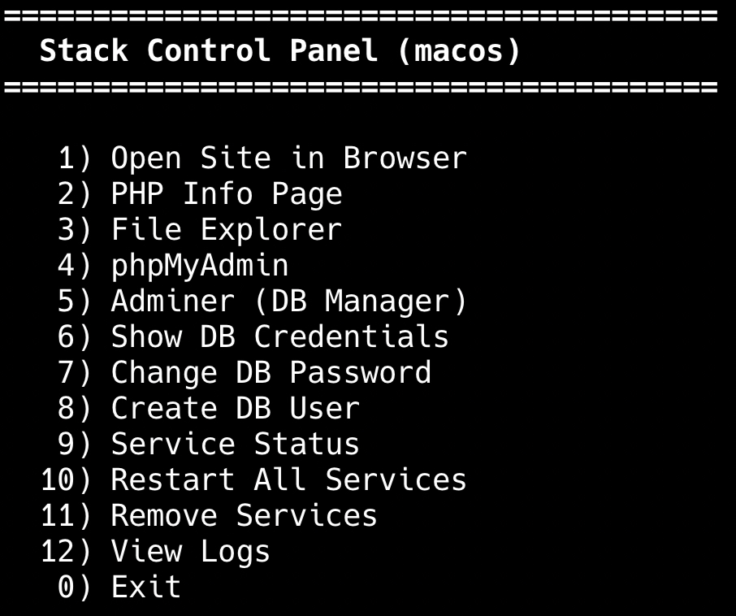

# Stack Installer

Interactive LAMP/LEMP stack setup script with a post-installation control panel. Simple inline terminal prompts — no full-screen TUI needed.

**Supports:** Ubuntu/Debian, Fedora/RHEL/CentOS, macOS (Homebrew)



## What It Does

**Installation wizard** — walks you through selecting:
- Web server (Apache or Nginx)
- SQL databases (MySQL, MariaDB, PostgreSQL)
- NoSQL database (MongoDB)
- PHP extensions (18+ pre-checked on Linux, PECL on macOS)
- PHP ini settings (upload size, memory limit, execution time, etc.)
- Document root and port

**Control panel** — accessible after install or anytime via `--panel`:

| Action | Description |
|--------|-------------|
| Open Site | Opens `http://localhost:<port>` in browser |
| PHP Info | Creates/opens `info.php` |
| File Explorer | Deploys a secure single-file PHP file browser (read-only, no traversal) |
| phpMyAdmin | Installs if missing, then opens in browser |
| Adminer | Downloads single-file DB manager to docroot |
| DB Credentials | Shows stored database usernames/passwords with live validation |
| Change DB Password | Reset a database password (auto-generate or enter manually) |
| Create DB User | Create a new database user with password and privilege grants |
| Service Status | Shows running/stopped state of all installed services |
| Restart Services | Restarts web server, PHP-FPM, and all databases |
| Remove Services | Selectively uninstall services with optional data purge |
| View Logs | Pick a service log and view the last 50 lines |

## Platform Support

| Feature | Ubuntu/Debian | Fedora/RHEL | macOS |
|---------|--------------|-------------|-------|
| Package manager | `apt-get` | `dnf` | `brew` |
| Service manager | `systemctl` | `systemctl` | `brew services` |
| Root required | Yes (`sudo`) | Yes (`sudo`) | No |
| Apache package | `apache2` | `httpd` | `httpd` |
| Web user | `www-data` | `apache` | current user |
| PHP install | PPA + versioned pkgs | dnf + php-fpm | Homebrew + PECL |
| Firewall | `ufw` | `firewalld` | Skipped (use System Settings) |
| Config paths | `/etc/apache2/...` | `/etc/httpd/...` | `/opt/homebrew/etc/...` |
| Default docroot | `/var/www/html` | `/var/www/html` | `/opt/homebrew/var/www` |
| Config storage | `/etc/stack-panel.conf` | `/etc/stack-panel.conf` | `~/.stack-panel.conf` |
| Creds storage | `/etc/stack-panel.creds` | `/etc/stack-panel.creds` | `~/.stack-panel.creds` |
| Browser open | `xdg-open` | `xdg-open` | `open` |
| `sed -i` | `sed -i` | `sed -i` | `sed -i ''` (BSD) |

## Usage

### Fresh Server Setup

1. **Clone the repo**:
   ```bash
   git clone https://github.com/Rex-Arnab/php-lamp-stack-installer.git
   cd php-lamp-stack-installer
   ```

2. **Make it executable and run**:
   ```bash
   chmod +x setup-stack.sh

   # Linux (Ubuntu/Debian/Fedora)
   sudo ./setup-stack.sh

   # macOS (no sudo needed)
   ./setup-stack.sh
   ```

3. **Walk through the menus** — the script will present dialog screens in order:
   - **Web Server** — pick Apache or Nginx (radio buttons, SPACE to select, ENTER to confirm)
   - **SQL Databases** — check any combination of MySQL, MariaDB, PostgreSQL (checklist)
   - **MongoDB** — yes/no prompt
   - **PHP Extensions** — 18+ pre-selected on Linux, PECL extensions on macOS (checklist)
   - **PHP Settings** — edit upload size, memory limit, execution time, etc. (form)
   - **Document Root** — defaults vary by platform
   - **Port** — defaults to `80`
   - **Confirmation** — review all selections before installing

4. **Installation runs automatically** — PHP, web server, databases, firewall, all configured.

5. **Control panel launches** after install completes — manage your stack immediately.

### Using the Control Panel

After installation, the control panel launches automatically. To access it later:

```bash
# Linux
sudo ./setup-stack.sh --panel

# macOS
./setup-stack.sh --panel
```

Navigate with arrow keys and ENTER. The menu loops until you choose **Exit**.

**What each option does:**

- **Open Site in Browser** — opens `http://localhost:<port>` via `xdg-open` (Linux) or `open` (macOS). If no display is detected (SSH session), prints the URL instead.
- **PHP Info** — creates `info.php` in your document root (if missing) and opens it. Useful for verifying PHP version and loaded extensions.
- **File Explorer** — deploys a single-file PHP browser at `explorer.php`. Browse files in your document root with sizes and dates. Read-only, no traversal outside docroot.
- **phpMyAdmin** — if not installed, prompts to install it. For Nginx, auto-symlinks into your docroot. Then opens in browser.
- **Adminer** — downloads the single-file `adminer.php` database manager into your docroot. Supports MySQL, MariaDB, PostgreSQL, MongoDB — all in one file.
- **Show DB Credentials** — displays stored database usernames and passwords. Each credential is live-validated against the actual database — if someone changed the password via phpMyAdmin, CLI, or any other tool, it shows `[CHANGED externally]` instead of `[VALID]`.
- **Change DB Password** — pick an installed database, then choose to auto-generate a secure 20-char password or enter one manually. The new password is applied directly to the database and the credentials store is updated. Supports MySQL, MariaDB, PostgreSQL, and MongoDB.
- **Create DB User** — create a new user on any installed database. Prompts for username, password (auto or manual), and privilege level. For MySQL/MariaDB/PostgreSQL you can grant all privileges, access to a specific database, or no grants. For MongoDB you pick the auth database and role (readWrite, read, dbAdmin, userAdmin, root). New credentials are saved to the store.
- **Service Status** — shows whether each installed service (web server, PHP-FPM, databases) is running, stopped, or failed.
- **Restart All Services** — restarts every installed service and reports success/failure for each.
- **Remove Services** — checklist of all installed services (web server, PHP, databases, phpMyAdmin, Adminer). Select any combination to remove. Asks for confirmation, then whether to purge data or keep it. Stops services, removes packages, cleans up config and credentials, and runs autoremove.
- **View Logs** — sub-menu to pick a service log (Apache/Nginx error/access, PHP-FPM, MySQL, PostgreSQL, MongoDB). Displays the last 50 lines. Log paths are platform-aware.
- **Exit** — closes the panel and returns to the terminal.

### Examples

```bash
# Set up a LEMP stack with PostgreSQL on port 8080
sudo ./setup-stack.sh
# → pick nginx, check postgresql, set port to 8080 in the menus

# Later, check if services are running
sudo ./setup-stack.sh --panel
# → select "Service Status"

# View Nginx error logs after a 500 error
sudo ./setup-stack.sh --panel
# → select "View Logs" → "Nginx Error Log"

# Add Adminer to manage your database
sudo ./setup-stack.sh --panel
# → select "Adminer" (auto-downloads if not present)

# Forgot your MySQL password? Reset it
sudo ./setup-stack.sh --panel
# → select "Change DB Password" → pick MySQL → auto-generate

# Create a new user for your app's database
sudo ./setup-stack.sh --panel
# → select "Create DB User" → pick database → set username/password/grants

# macOS — no sudo needed
./setup-stack.sh
./setup-stack.sh --panel
```

## Config

After installation, the script saves state to a config file:

- **Linux:** `/etc/stack-panel.conf`
- **macOS:** `~/.stack-panel.conf`

```
WEBSERVER=apache
DOCROOT=/var/www/html
PORT=80
PHP_VER=8.3
HAS_MYSQL=on
HAS_MARIADB=off
HAS_POSTGRESQL=off
HAS_MONGODB=off
HAS_PHPMYADMIN=off
HAS_ADMINER=off
DISTRO=debian
```

This config is read by `--panel` to detect what's installed.

## Requirements

| Platform | Prerequisites |
|----------|--------------|
| Ubuntu/Debian | Root access (`sudo`), `dialog` or `whiptail` (auto-installed) |
| Fedora/RHEL | Root access (`sudo`), `dialog` (auto-installed via `dnf`) |
| macOS | [Homebrew](https://brew.sh) installed, `dialog` (auto-installed via `brew`) |

## File Structure

```
stack-installer/
├── setup-stack.sh           # Entrypoint — sources modules, bootstrap, main()
├── lib/
│   ├── platform.sh          # OS detection + abstraction layer (pkg, svc, paths)
│   ├── menus.sh             # Interactive dialog menus (web server, DBs, PHP, etc.)
│   ├── install.sh           # Installation functions (PHP, Apache, Nginx, DBs, firewall)
│   └── panel.sh             # Control panel + all panel actions (13 menu items)
├── test-stack.sh            # Non-interactive Docker test harness (106 tests)
├── Dockerfile               # Ubuntu 22.04 test container
└── README.md
```

### Module Responsibilities

| Module | What it does |
|--------|-------------|
| `platform.sh` | Detects OS (`debian`/`fedora`/`macos`), sets all path variables, provides `pkg_install()`, `pkg_remove()`, `svc_start()`, `svc_stop()`, `svc_restart()`, `svc_status()`, `sed_i()`, `set_web_owner()`, `get_fpm_sock()`, `get_fpm_service()` |
| `menus.sh` | All `pick_*()` functions and `confirm_selections()` — the interactive wizard flow |
| `install.sh` | `install_php()`, `install_apache()`, `install_nginx()`, `install_mysql()`, `install_mariadb()`, `install_postgresql()`, `install_mongodb()`, `configure_php_ini()`, `setup_document_root()`, `configure_firewall()`, `restart_services()` |
| `panel.sh` | `control_panel()`, `save_stack_config()`, `load_stack_config()`, credentials management, `show_service_status()`, `show_logs_menu()`, `remove_services()`, `create_db_user()`, `change_db_password()`, `deploy_file_explorer()`, `install_phpmyadmin()`, `install_adminer()` |

## Testing

Tests run in Docker to avoid touching the host system.

### Run Tests

```bash
docker build -t stack-test .
docker run --rm stack-test
```

### Test Phases and Results

```
========================================
  Stack Installer Test Suite
========================================

[Phase 0] Syntax Validation
  PASS  bash -n setup-stack.sh
  PASS  bash -n lib/platform.sh
  PASS  bash -n lib/menus.sh
  PASS  bash -n lib/install.sh
  PASS  bash -n lib/panel.sh

[Phase 1] Function Unit Tests (sourcing modules)

  save_stack_config / load_stack_config
  PASS  Config file created
  PASS  Config has WEBSERVER
  PASS  Config has PORT
  PASS  Config has PHP_VER
  PASS  Config has HAS_MYSQL=on
  PASS  Config has HAS_MARIADB=off
  PASS  Config has HAS_PHPMYADMIN=off
  PASS  load_stack_config restores WEBSERVER
  PASS  load_stack_config restores PORT
  PASS  load_stack_config restores HAS_MYSQL

  create_phpinfo_page
  PASS  info.php created
  PASS  info.php has phpinfo()
  PASS  info.php idempotent (no error on re-run)

  deploy_file_explorer
  PASS  explorer.php created
  PASS  explorer.php has realpath guard
  PASS  explorer.php has production warning
  PASS  explorer.php restricts to docroot

  open_in_browser (headless)
  PASS  open_in_browser doesn't crash headless

  show_service_status (graceful handling)
  PASS  show_service_status doesn't crash without systemd

  generate_password
  PASS  generate_password produces output
  PASS  generate_password is 20 chars
  PASS  generate_password is random (two calls differ)

  save_credential / show_db_credentials
  PASS  Creds file created
  PASS  Creds file has 600 permissions
  PASS  Creds has MySQL entry
  PASS  Creds has PostgreSQL entry
  PASS  save_credential replaces (no duplicate)
  PASS  Creds has updated MySQL password
  PASS  show_db_credentials doesn't crash
  PASS  show_db_credentials handles missing file

  change_db_password
  PASS  change_db_password handles missing creds file
  PASS  change_db_password handles empty creds file
  PASS  change_db_password handles MySQL
  PASS  change_db_password handles MariaDB
  PASS  change_db_password handles PostgreSQL
  PASS  change_db_password handles MongoDB
  PASS  change_db_password offers auto-generate
  PASS  change_db_password offers manual entry
  PASS  change_db_password saves updated cred

  create_db_user
  PASS  create_db_user handles no databases
  PASS  create_db_user has MySQL CREATE USER
  PASS  create_db_user has PostgreSQL CREATE USER
  PASS  create_db_user has MongoDB createUser
  PASS  create_db_user supports grant all
  PASS  create_db_user supports grant specific db
  PASS  create_db_user supports MongoDB roles
  PASS  create_db_user saves new credential
  PASS  Multiple users per DB in creds file

  remove_services
  PASS  remove_services handles no services
  PASS  remove_services stops before purging
  PASS  remove_services supports purge option
  PASS  remove_services runs autoremove
  PASS  remove_services updates config for MySQL
  PASS  remove_services updates config for MariaDB
  PASS  remove_services updates config for PostgreSQL
  PASS  remove_services updates config for MongoDB
  PASS  remove_services cleans credentials
  PASS  remove_services has confirmation dialog
  PASS  remove_services asks about data
  PASS  remove_services handles phpmyadmin
  PASS  remove_services handles adminer
  PASS  Config sed correctly sets HAS_MYSQL=off
  PASS  Config sed correctly sets HAS_PHPMYADMIN=off
  PASS  Config preserves HAS_POSTGRESQL=on

[Phase 2] --panel Flag Routing
  PASS  main() checks --panel flag
  PASS  main() calls load_stack_config for --panel
  PASS  main() calls control_panel for --panel

[Phase 3] Control Panel Structure
  PASS  Panel has open-site option
  PASS  Panel has phpinfo option
  PASS  Panel has files option
  PASS  Panel has phpmyadmin option
  PASS  Panel has adminer option
  PASS  Panel has db-creds option
  PASS  Panel has db-passwd option
  PASS  Panel has db-user option
  PASS  Panel has status option
  PASS  Panel has restart option
  PASS  Panel has remove option
  PASS  Panel has logs option
  PASS  Panel has exit option

[Phase 4] Adminer Install
  PASS  Adminer downloaded
  PASS  Config updated HAS_ADMINER=on

[Phase 5] Log Paths in show_logs_menu
  PASS  Apache error log path
  PASS  Apache access log path
  PASS  Nginx error log path
  PASS  PHP-FPM log path
  PASS  MySQL log path
  PASS  PostgreSQL log path
  PASS  MongoDB log path

[Phase 6] explorer.php Security
  PASS  No file upload capability
  PASS  explorer.php has no dangerous write/exec functions
  PASS  Path traversal guard (realpath check)

[Phase 7] PHP Syntax Validation
  SKIP  PHP not installed in test container — skipping syntax checks

[Phase 8] Config Round-Trip (nginx + postgresql)
  PASS  Round-trip: WEBSERVER=nginx
  PASS  Round-trip: PORT=8080
  PASS  Round-trip: DOCROOT=/srv/www
  PASS  Round-trip: HAS_POSTGRESQL=on
  PASS  Round-trip: HAS_MONGODB=on
  PASS  Round-trip: HAS_MYSQL=off
  PASS  Reload: SEL_WEBSERVER=nginx
  PASS  Reload: SEL_PORT=8080
  PASS  Reload: SEL_POSTGRESQL=on

========================================
  Test Results
========================================
  Passed: 106
  Failed: 0
  Total:  106

  ALL TESTS PASSED
```

### Test Coverage

| Phase | Area | Tests |
|-------|------|-------|
| 0 | Bash syntax — all 5 files (`bash -n`) | 5 |
| 1 | Config save/load, phpinfo, file explorer, browser open, service status, password generation, credential storage/display, password change, user creation, service removal | 65 |
| 2 | `--panel` flag routing in `main()` | 3 |
| 3 | All 13 control panel menu items present | 13 |
| 4 | Adminer download + config update | 2 |
| 5 | Log file paths for all services | 7 |
| 6 | explorer.php security (no dangerous functions, traversal guard) | 3 |
| 7 | PHP syntax validation (skipped without PHP) | 0 |
| 8 | Config round-trip with alternate values | 9 |

## Security Notes

- `explorer.php` is read-only — no upload, delete, or edit. Paths are validated with `realpath()` to prevent directory traversal.
- `info.php` and `explorer.php` display a warning banner: remove them in production.
- phpMyAdmin and Adminer are development tools — restrict access or remove before going live.
- DB credentials are stored with `chmod 600` (owner-only). On Linux at `/etc/stack-panel.creds` (root-only), on macOS at `~/.stack-panel.creds`. Passwords are auto-generated (20 chars, alphanumeric + symbols) during installation. The panel live-validates stored passwords — if a password was changed externally (via phpMyAdmin, CLI, etc.), it shows `[CHANGED externally]` so you know the stored value is stale.
